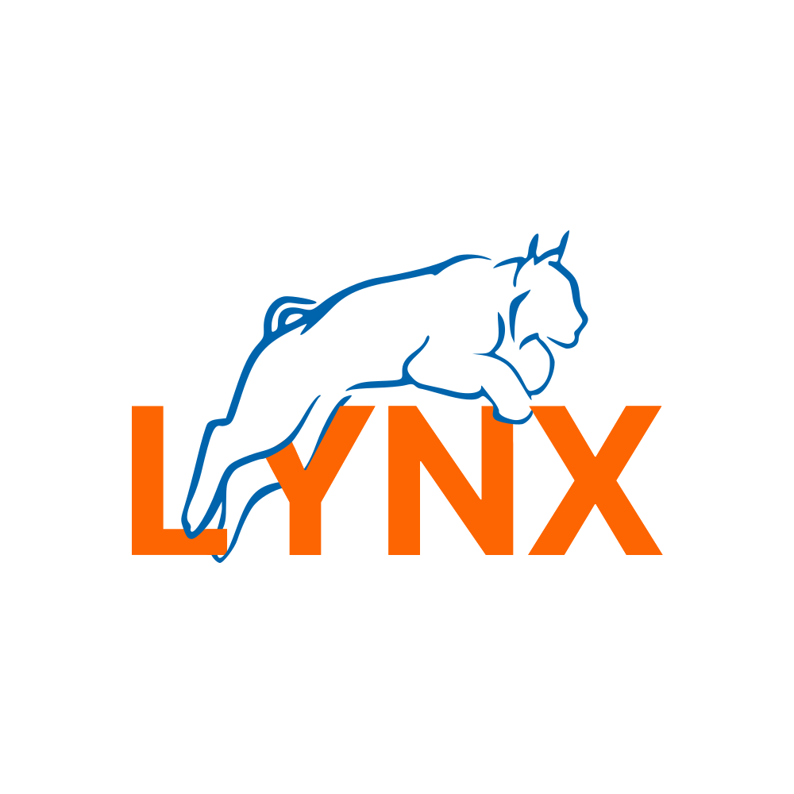

 

      

---

 
<h2 align="center">About</h2>

To date, PSG "Lynx" is an autonomous professional search and rescue unit in the state of which there are cartographers, coordinators, doctors, psychologists, climbers, divers, cynologists, jeepers, quad bikers, hang gliders.
  
The task was to write software that simplifies the collection of statistical information about search engines, volunteers, search fees.

  
---
Libraries:
- <a href="https://www.nuget.org/packages/Camera.MAUI">Camera.MAUI</a>
- <a href="https://learn.microsoft.com/en-us/dotnet/communitytoolkit/maui/">CommunityToolkit.Maui</a> 
- <a href="https://enisn-projects.io/docs/en/inputkit/latest">InputKit.Maui</a>
- <a href="https://www.nuget.org/packages/LiveChartsCore.SkiaSharpView.Maui/">LiveChartsCore.SkiaSharpView.Maui</a>
- <a href="https://www.nuget.org/packages/Mopups/"> Mopups </a>
- <a href="https://www.nuget.org/packages/Newtonsoft.Json/"> Newtonsoft.Json</a>
- <a href="https://www.nuget.org/packages/SkiaSharp.Extended.UI.Maui"> SkiaSharp.Extended.UI.Maui </a>
- <a href="https://enisn-projects.io/docs/en/uranium/latest">UraniumUI</a>
 
Api:
- <a href="https://github.com/ITKory/lynxApi">LynxApi</a>

 

---

 
<h2 align="center">Functional</h2>

- Create search requests
- Organization of search fees
- Registration for search
 

 
<h2 align="center">In development</h2>

- Crew grouping
- Accounting statistics
 

 

---

 
<h2 align="center">Preview</h2>

 

 

 
 

 

---

   

